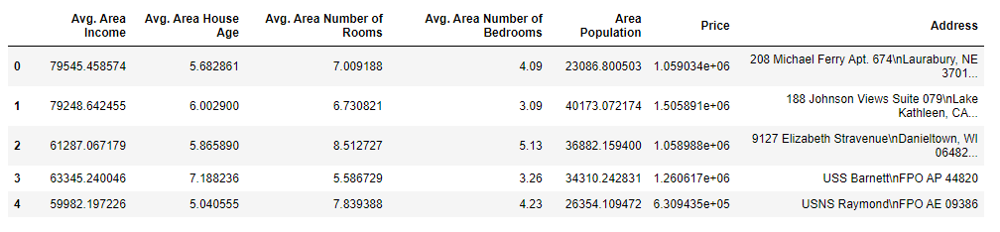

# Prevision_de_prix_de_logement_usa

L'immobilier a toujours été un secteur fascinant et dynamique, influencé par une multitude de facteurs économiques et sociaux. En 2024, la prévision des prix des maisons aux États-Unis est plus pertinente que jamais, compte tenu des fluctuations du marché, des taux d'intérêt variables et des tendances démographiques changeantes. Prédire avec précision les prix des maisons peut offrir un avantage significatif aux investisseurs, aux acheteurs potentiels, et même aux professionnels de l'immobilier.

Dans cet article, nous vous guiderons à travers un projet de prévision des prix des maisons en utilisant un ensemble de données sur le logement aux États-Unis. Nous exploiterons la puissance des techniques de machine learning pour analyser les données, construire un modèle de régression et faire des prédictions précises. Ce projet est conçu pour être accessible aux débutants en science des données, tout en étant suffisamment robuste pour intéresser les praticiens plus expérimentés.

Nous commencerons par explorer les variables clés qui influencent les prix des maisons, telles que le revenu moyen de la région, l'âge moyen des maisons, le nombre moyen de pièces et de chambres, et la population de la région. Ensuite, nous préparerons et nettoierons les données pour nous assurer que notre modèle est aussi précis que possible. Après cela, nous construirons un modèle de régression linéaire pour prédire les prix des maisons, en utilisant des outils de la bibliothèque scikit-learn de Python.

L'objectif de cet article est double : vous fournir une compréhension pratique des techniques de prévision des prix immobiliers et vous offrir un code source complet que vous pourrez adapter et utiliser dans vos propres projets. Que vous soyez un développeur cherchant à améliorer vos compétences en machine learning ou un investisseur souhaitant mieux comprendre le marché immobilier, ce guide est fait pour vous.

Préparez-vous à plonger dans le monde fascinant de la prévision des prix immobiliers et à découvrir comment les données peuvent vous aider à prendre des décisions plus éclairées et stratégiques.Télécharger les données ici:code_source_gihub_prix_de_logement_des_USA

Étape 1 – Importation des bibliothèques requises.
# Importer les bibliothèques nécessaires
import pandas as pd         # Pour la manipulation des données
import numpy as np          # Pour les opérations numériques
import matplotlib.pyplot as plt        # Pour la visualisation des données
import seaborn as sns                  # Pour la visualisation des données avancée
from sklearn.metrics import r2_score              # Pour évaluer les performances du modèle
from sklearn.preprocessing import StandardScaler     # Pour normaliser les données
from sklearn.model_selection import train_test_split     # Pour diviser les données en ensembles d'entraînement et de test
from sklearn.linear_model import LinearRegression     # Pour créer un modèle de régression linéaire

# Charger les données
data = pd.read_csv('USA_Housing.csv')

Étape 2 – Lecture de nos données d’entrée pour la prévision des prix des maisons.
# Afficher les premières lignes du dataset pour avoir un aperçu des données
print(data.head())

Étape 3 – Analyse des informations à partir de nos données.

# Afficher des informations sur les colonnes et les types de données
print(data.info())

Étape 4 – Décription de nos données.

# Décrire les statistiques descriptives des données
print(data.describe())

Étape 5 - Graphiques pour visualiser les données de la prévision du prix des maisons.

#- Analyse de la corrélation entre les variables pour voir les relations potentielles
plt.figure(figsize=(10,8))
sns.heatmap(data.corr(), annot=True, cmap='coolwarm')
plt.show()

Étape 6 – Mise à l’échelle de nos données.

# Définir les features (variables indépendantes) et la target (variable dépendante)

x = data.drop(["Price","Address"],axis=1)
y = data["Price"]

# Diviser les données en ensembles d'entraînement (70%) et de test (30%)
x_train, x_test, y_train, y_test = train_test_split(x, y, test_size=0.3, random_state=101)

# Initialiser le scaler pour normaliser les données
scaler = StandardScaler()

# Ajuster le scaler sur les données d'entraînement et transformer les données

cols = x.columns
x = scaler.fit_transform(x)

Nous devons faire évoluer nos données pour tout ramener à une seule échelle ou dans une seule plage.

Nous utilisons ici StandardScaler pour mettre à l'échelle nos données.

Consultez simplement la première image des données d'entrée et voyez comment les différentes colonnes appartiennent à différentes échelles.

Étape 8 – Entraînement de notre modèle de régression linéaire pour la prévision des prix des maisons.
# Initialiser et entraîner le modèle de régression linéaire
model = LinearRegression()
model.fit(x_train, y_train)

# Faire des prédictions sur l'ensemble de test
pred = model.predict(x_test)

# Évaluer les performances du modèle en utilisant le coefficient de détermination R²

score = r2_score(y_test,pred)
print(f" Le score après entraînement de ce modèle est: {score} ")

Le score R², également appelé coefficient de détermination, mesure la proportion de la variance de la variable dépendante (Price) qui est prédite par les variables indépendantes (features). Un score R² de 0.9185 signifie que 91.85 % de la variance des prix des maisons peut être expliquée par notre modèle de régression linéaire. C'est un très bon score, indiquant que notre modèle est performant.

Étape 9 - Visualisons nos prédictions de la prédiction du prix de l’immobilier.
# Visualiser les prédictions par rapport aux valeurs réelles
plt.figure(figsize=(10,6))
plt.scatter(y_test, pred)
plt.xlabel('Valeurs Réelles')
plt.ylabel('Prédictions')
plt.title('Prédictions vs Valeurs Réelles')
plt.show()

Étape 10 – Tracer les résidus de notre modèle de prévision du prix des maisons.

Étape 11 – Observez les coefficients.
cols = ['Avg. Area Income', 'Avg. Area House Age', 'Avg. Area Number of Rooms', 'Avg. Area Number of Bedrooms', 'Area Population']

cdf = pd.DataFrame(model.coef_, cols, columns=['coefficients']).sort_values("coefficients", ascending=False)

print(cdf)

Avg. Area Income (230,377.52) : Le revenu moyen de la région a le plus grand impact sur le prix des maisons. Pour chaque augmentation d'une unité de revenu moyen, le prix de la maison augmente de 230,377.52 unités.
Avg. Area House Age (163,793.12) : L'âge moyen des maisons dans la région est le deuxième facteur le plus important. Les maisons plus anciennes tendent à avoir des prix plus élevés.
Area Population (151,104.85) : La population de la région a également un impact significatif sur le prix des maisons. Les régions plus peuplées ont des prix de maisons plus élevés.
Avg. Area Number of Rooms (122,101.35) : Le nombre moyen de pièces dans les maisons est aussi un facteur important. Plus il y a de pièces, plus le prix est élevé.
Avg. Area Number of Bedrooms (1,627.32) : Le nombre moyen de chambres a le plus petit impact sur le prix des maisons, mais reste néanmoins positif. Plus il y a de chambres, plus le prix est élevé.
Ces interprétations permettent de comprendre quelles variables sont les plus influentes dans la détermination des prix des maisons et comment elles affectent le modèle de régression linéaire.

Conclusion
En résumé, ce projet montre comment utiliser des techniques de machine learning pour prédire les prix des maisons en utilisant un modèle de régression linéaire. Les résultats indiquent que le modèle est performant avec un score R² élevé et que certaines variables comme le revenu moyen de la région et l'âge moyen des maisons ont un impact significatif sur le prix des maisons. Vous pouvez utiliser ce modèle et ces informations pour effectuer des analyses similaires sur d'autres ensembles de données ou pour améliorer vos compétences en machine learning et en data science. voici les données ici: code_source_gihub_prix_de_logement_des_USA